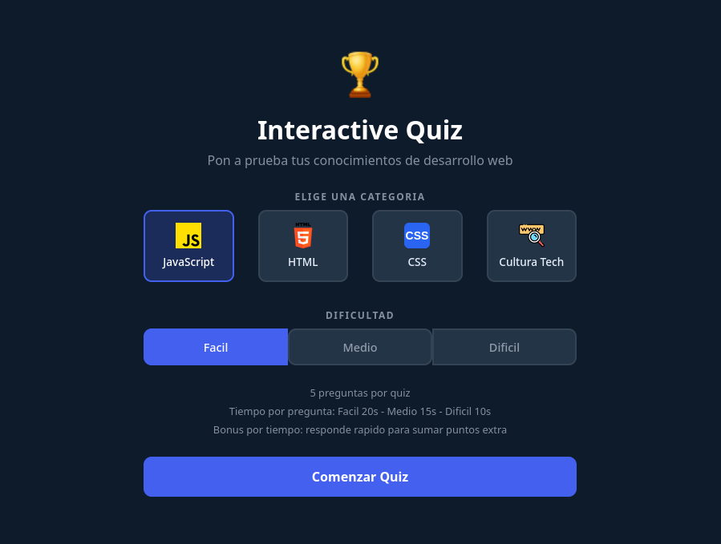
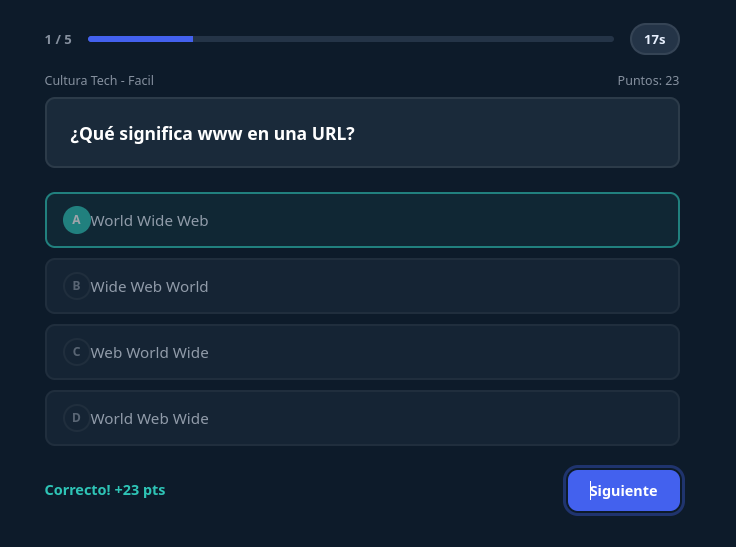
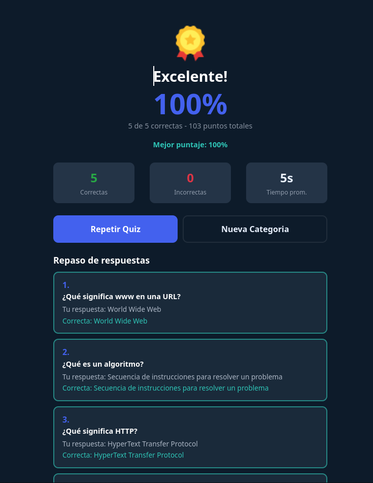
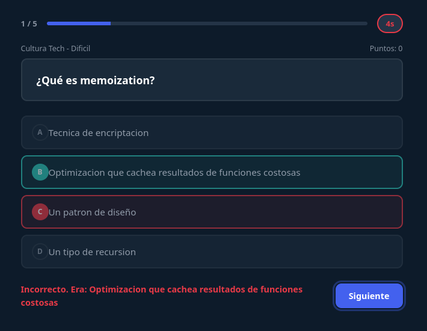
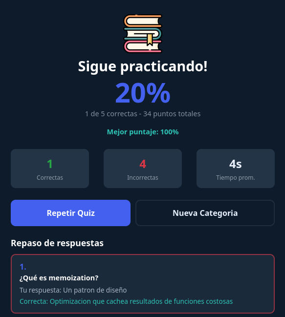

# Interactive Quiz

Sitio estatico interactivo para practicar conocimientos de desarrollo web.
El proyecto funciona completamente en el navegador con HTML, CSS, JavaScript, jQuery y Bootstrap.

## Caracteristicas

- Seleccion de categoria (JavaScript, HTML, CSS, Cultura Tech)
- Seleccion de dificultad (Facil, Medio, Dificil)
- 5 preguntas por quiz
- Temporizador por pregunta con bonus por tiempo
- Puntaje en tiempo real
- Barra de progreso
- Retroalimentacion inmediata
- Repaso de respuestas al final
- Mejor puntaje guardado en el navegador

## Capturas

### Pantalla de inicio

Seleccion de categoria, dificultad y datos del quiz.



### Pregunta del quiz

Una pregunta con temporizador, barra de progreso y puntaje en tiempo real.



### Retroalimentacion de respuesta

La respuesta seleccionada se marca y se muestra retroalimentacion inmediata.



### Pantalla de resultados

Puntaje final, estadisticas y mejor puntaje guardado en el navegador.



### Repaso de respuestas

Lista con cada pregunta, la respuesta del usuario y la correcta.



## Tecnologias

- HTML5
- CSS3
- JavaScript
- jQuery 3.7.1
- Bootstrap 4.3.1

## Estructura

```text
interactive_quiz/
├── index.html
├── css/
│   └── style.css
├── js/
│   └── script.js
└── img/
```

## Como ejecutarlo

Es un sitio estatico: abre `index.html` directamente en el navegador o usa un servidor local.

```bash
python3 -m http.server 8000
```

Luego entra a `http://localhost:8000`.

## Notas

- No requiere backend
- No requiere base de datos
- No necesita proceso de build
- Sitio estatico con interaccion del lado del cliente
